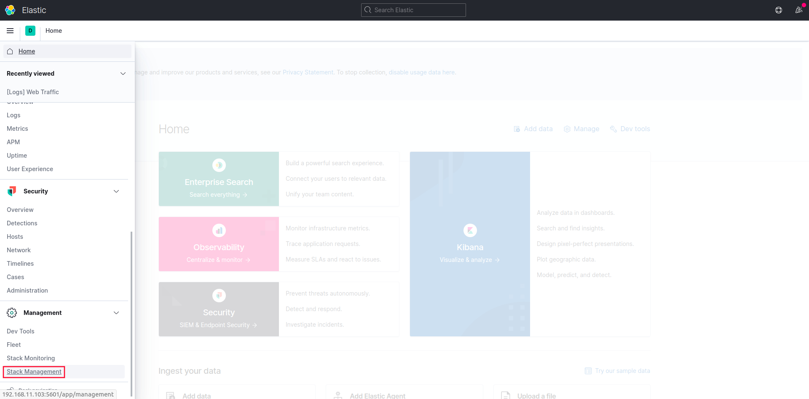
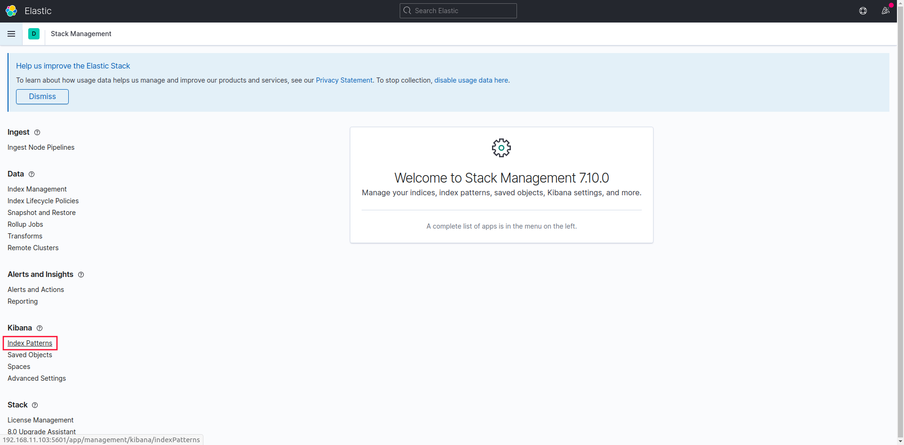
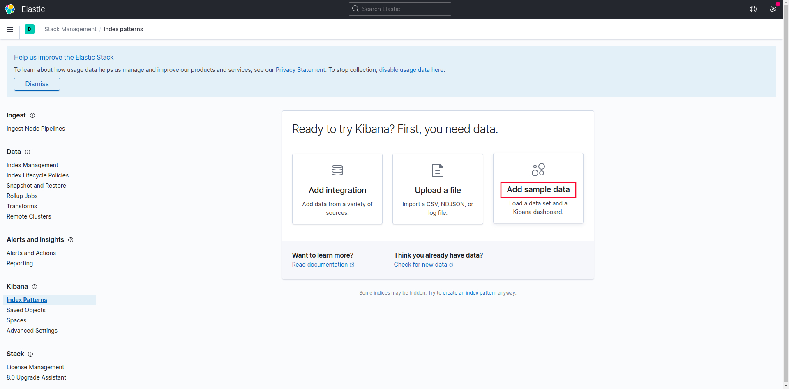
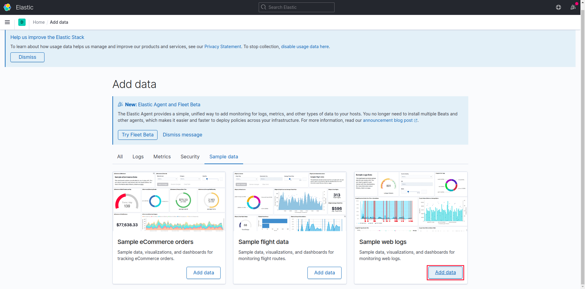
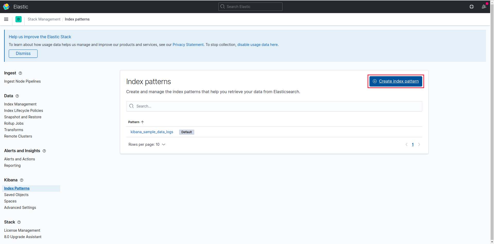
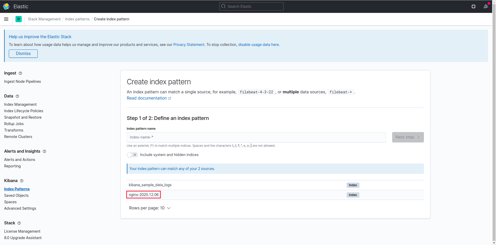
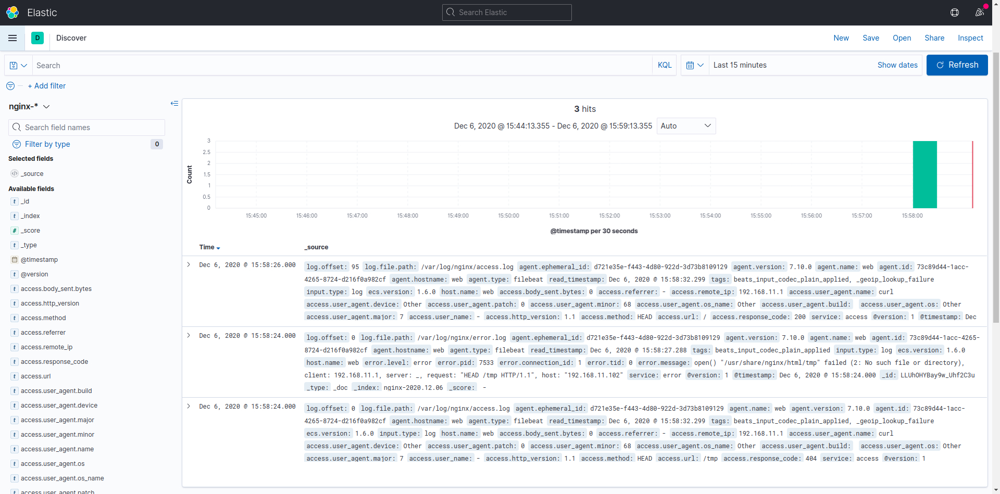

## Стенд для занития для сбора и анализа логов.

Цель:

в вагранте поднимаем 2 машины web и log
на web поднимаем nginx
на log настраиваем центральный лог сервер на любой системе на выбор
- journald
- rsyslog
- elk
настраиваем аудит следящий за изменением конфигов нжинкса.
все критичные логи с web должны собираться и локально и удаленно
все логи с nginx должны уходить на удаленный сервер (локально только критичные)
логи аудита должны также уходить на удаленную систему


* развернуть еще машину elk
и таким образом настроить 2 центральных лог системы elk и какую либо еще
в elk должны уходить только логи нжинкса, во вторую систему все остальное

## Реализация.

- [Инструкция по установки log и web ](./INSTALL.md)
- [Инструкция по установки elk ](./INSTALL.md)

```
	log: 192.168.11.101
	web: 192.168.11.102
	elk: 192.168.11.103
```

Для проверки необходимо, в терминале запустить `vagrant up`

1. Проверим, что аудит за изменением конфигов нжинкса, уходить на удаленный сервер `log`. Для этого на `web` хосте, изменим файл конфигурации nginx.
На центральном лог сервере `log` проверим.

```
[root@log ~]# ausearch -k nginx_conf
```

2. Проверим критичные логи, для этого на `web` хосте, с иметируем отправку лога.
```
[root@web ~]# logger -p local7.crit "TEST CRITICAL"
```
На `web` хосте проверим
```
[root@web ~]# tail /var/log/boot.log | grep 'TEST CRITICAL'
Dec  6 15:29:47 web vagrant: TEST CRITICAL
```
На центральном лог сервере `log` проверим.
```
[root@log ~]# tail /var/log/rsyslog/web/vagrant.log
2020-12-06T15:29:47+03:00 web vagrant: TEST CRITICAL
```

3. Проверим логи nginx, для этого на центральном лог сервере `log`.
- на доступ 
```
[root@log ~]# curl -I 192.168.11.102
HTTP/1.1 200 OK
Server: nginx/1.16.1
Date: Fri, 04 Dec 2020 05:44:25 GMT
Content-Type: text/html
Content-Length: 4833
Last-Modified: Fri, 16 May 2014 15:12:48 GMT
Connection: keep-alive
ETag: "53762af0-12e1"
Accept-Ranges: bytes
```
Проверим лог на доступ
```
[root@log ~]# tail /var/log/rsyslog/web/nginx_access.log
2020-12-04T08:44:25+03:00 web nginx_access: 192.168.11.101 - - [04/Dec/2020:08:44:25 +0300] "HEAD / HTTP/1.1" 200 0 "-" "curl/7.29.0" "-"

```
- на ошибки
```
[root@log ~]# curl -I 192.168.11.102/tmp
HTTP/1.1 404 Not Found
Server: nginx/1.16.1
Date: Fri, 04 Dec 2020 05:48:05 GMT
Content-Type: text/html
Content-Length: 3650
Connection: keep-alive
ETag: "5f9e16e8-e42"

```
Проверим лог на ошибки
```
tail /var/log/rsyslog/web/nginx_error.log
2020-12-04T08:48:05+03:00 web nginx_error: 2020/12/04 08:48:05 [error] 4703#0: *2 open() "/usr/share/nginx/html/tmp" failed (2: No such file or directory), client: 192.168.11.101, server: _, request: "HEAD /tmp HTTP/1.1", host: "192.168.11.102"

```
#### Дополнительное задание *
Для проверки необходимо, в терминале запустить `ansible-playbook elk.yml`. Выполнить эти команды `curl -I 192.168.11.102` и `curl -I 192.168.11.102/tmp`, для того, что бы появились записи логов nginx. В браузере передти на страницу `http://192.168.11.103:5601/` и настроить.








Таким образом на центральных лог системы `elk` приходят только логи `nginx`, а на второй центральных лог системы `log` все остальные логи `web` хоста.
